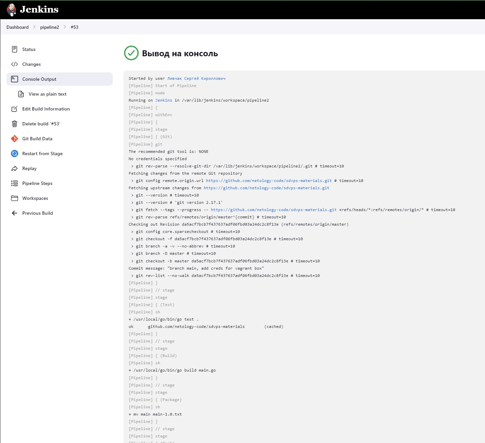
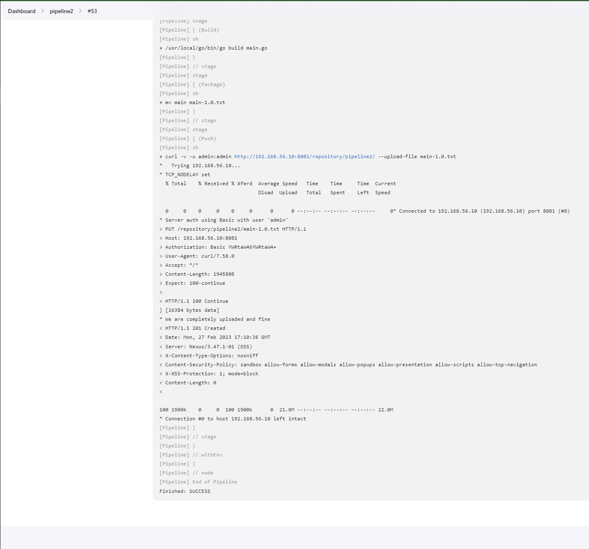

# Домашнее задание к занятию "`8-02hw`" - `Ливчак Сергей`

---

### Задание 1

`Вложение скриншотов к заданию 1`

1. `Установил виртуальную машину с дженкинс при помощи vagrand на локальную машину`
2. `склонировал из своего репозитория всё необходимое`
3. `Создал фристайл проект и подключил к нему гит`
4. `произвел запуск тестов`


**Скриншот 1** Настройка


**Скриншот 2** Настройка


**Скриншот 3** Вывод


**Скриншот 4** Вывод


---

### Задание 2

`Сделать в декларативной форме задание`

1. `Создал "pipeline"`
2. `изменил в нём данные на свои и отредактировал место запуска скрипта`
3. `произвел запуск тестов`


**Скриншот 5** Настройка


**Скриншот 6** Вывод


**Скриншот 7** Вывод


**Скриншот 8** Вывод из Nexus


---

### Задание 3

`Cборка и пуш в Nexus`

1. `Исполнить команду "go build main.go" удалось только явно указав путь до файла go*, пытался прописывать path разными способавми, не сработало, в vagrand тоже не работало`
2. `Пушим в нексус3 переименованный файл с учётом версии`

**Скриншот 9** 


**Скриншот 10** 


**Скриншот 11** 


```
pipeline {
 agent any
  environment {
    VERSION = '1.0'
  }
 stages {
  stage('Git') {
   steps {git 'https://github.com/netology-code/sdvps-materials.git'}
  }
  stage('Test') {
   steps {
    sh '/usr/local/go/bin/go test .'
   }
  }
    stage('Build') {
   steps {
    sh '/usr/local/go/bin/go build main.go'
   }
  }
   stage('Package') {
      steps {
        sh "mv main main-${VERSION}.txt"
        // Package your project, adding the version to the filename
      }
    }
    stage('Push') {
   steps {
    sh 'curl -v -u admin:admin http://192.168.56.10:8081/repository/pipeline2/ --upload-file *.txt'
  }
 }
}
}

```

### Задание 4

`Делаем так чтобы загруженный артифакт отображал версию сборки `

1. `устанавливаем плагин Nexus Artifact Uploader`
2. `создаём "credentials" и копируем их номер`
3. `загружаем файл этим плагином в Nexus3`

```
pipeline {
 agent any
 stages {
  stage('Git') {
   steps {git 'https://github.com/netology-code/sdvps-materials.git'}
  }
  stage('Test') {
   steps {
    sh '/usr/local/go/bin/go test .'
   }
  }
    stage('Build') {
   steps {
    sh '/usr/local/go/bin/go build main.go'
   }
  }
    stage('Upload') {
      steps {
        nexusArtifactUploader(
          nexusVersion: 'nexus3',
          protocol: 'http',
          nexusUrl: '192.168.56.10:8081',
          groupId: 'com.example',
          version: "1.0.${env.BUILD_NUMBER}",
          repository: 'pipeline2',
          credentialsId: '6d6ce6b5-0099-445f-bc7c-2a98fb202aea',
          artifacts: [
            [artifactId: 'main', classifier: '', file: 'main.go', type: 'go']
          ]
        )
      }
    }
}
}

```