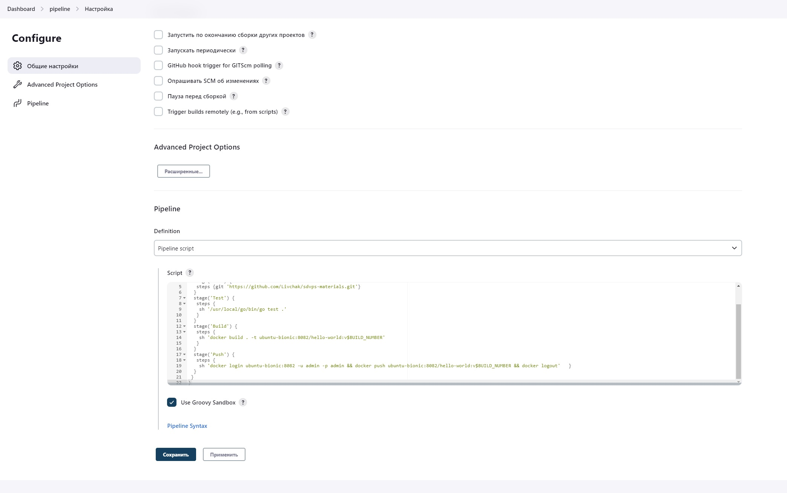
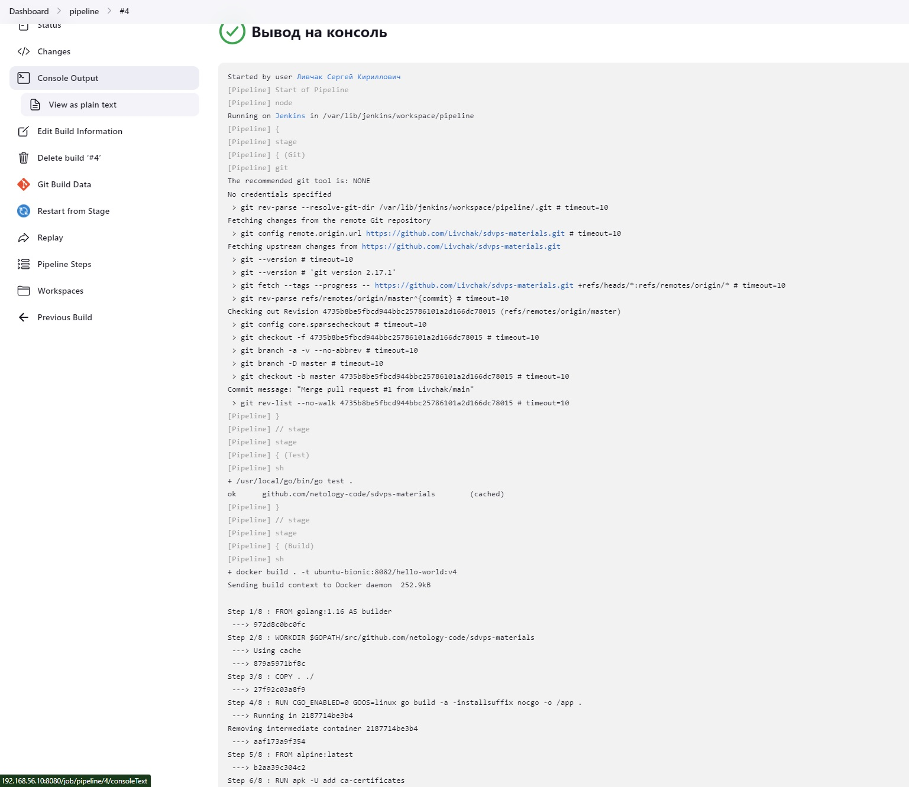
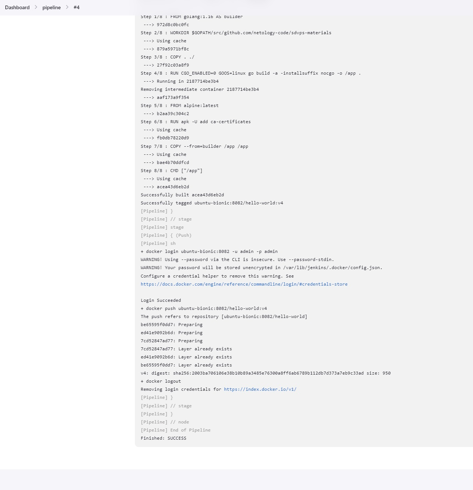
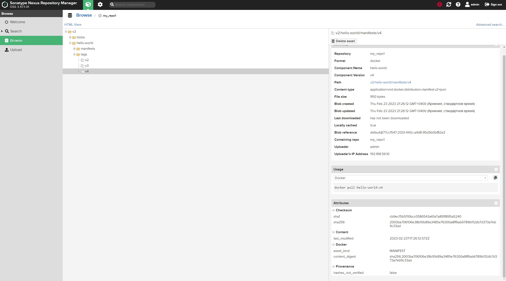
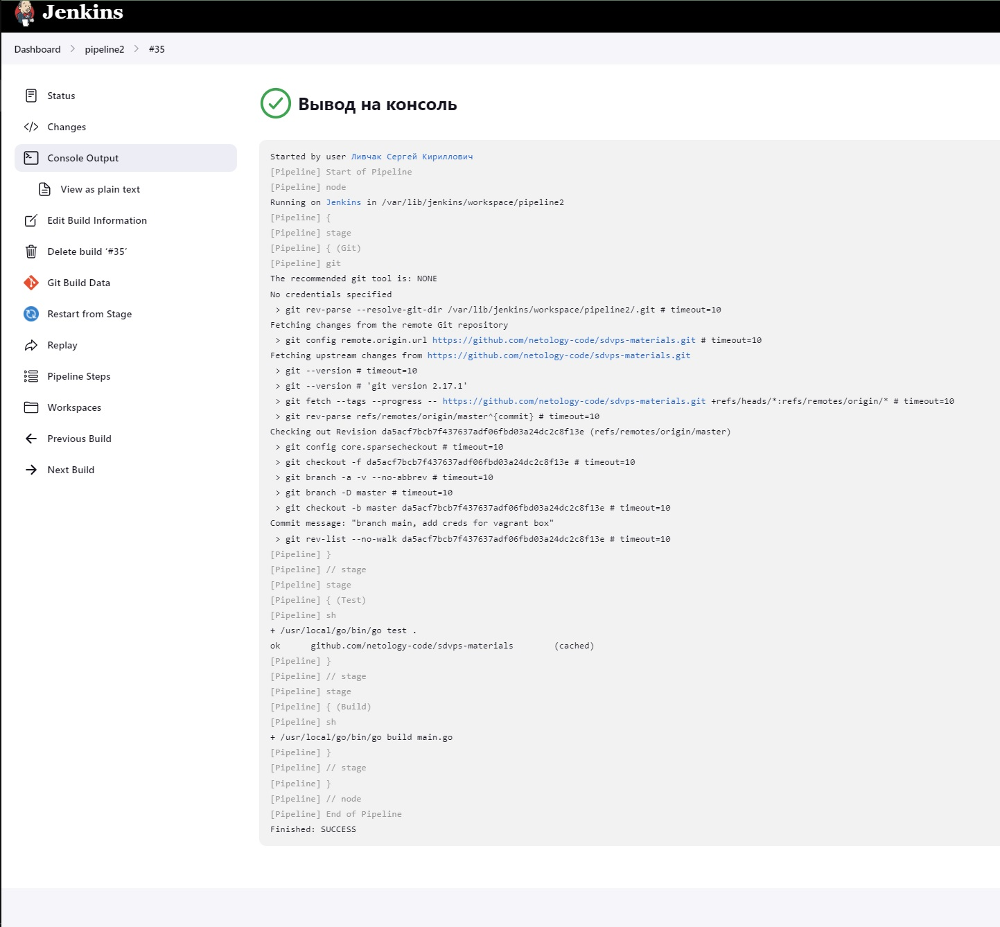

# Домашнее задание к занятию "`8-02hw`" - `Ливчак Сергей`

---

### Задание 1

`Вложение скриншотов к заданию 1`

1. `Установил виртуальную машину с дженкинс при помощи vagrand на локальную машину`
2. `склонировал из своего репозитория всё необходимое`
3. `Создал фристайл проект и подключил к нему гит`
4. `произвел запуск тестов`


**Скриншот 1** Настройка


**Скриншот 2** Настройка


**Скриншот 3** Вывод


**Скриншот 4** Вывод


---

### Задание 2

`Сделать в декларативной форме задание`

1. `Создал "pipeline"`
2. `изменил в нём данные на свои и отредактировал место запуска скрипта`
3. `произвел запуск тестов`


**Скриншот 5** Настройка


**Скриншот 6** Вывод


**Скриншот 7** Вывод


**Скриншот 8** Вывод из Nexus


---

### Задание 3

`Cборка и пуш в Nexus`

1. `Исполнить команду "go build main.go" удалось только явно указав путь до файла go*, пытался прописывать path разными способавми, не сработало, в vagrand тоже не работало`
2. `Как сделать пуш файла в нексус, не могу разобраться`

**Скриншот 9** 



### Задание 4

`Приведите ответ в свободной форме........`

1. `Заполните здесь этапы выполнения, если требуется ....`
2. `Заполните здесь этапы выполнения, если требуется ....`
3. `Заполните здесь этапы выполнения, если требуется ....`
4. `Заполните здесь этапы выполнения, если требуется ....`
5. `Заполните здесь этапы выполнения, если требуется ....`
6. 

```
Поле для вставки кода...
....
....
....
....
```

`При необходимости прикрепитe сюда скриншоты
`

---
## Дополнительные задания (со звездочкой*)

Эти задания дополнительные (не обязательные к выполнению) и никак не повлияют на получение вами зачета по этому домашнему заданию. Вы можете их выполнить, если хотите глубже и/или шире разобраться в материале.

### Задание 5

`Приведите ответ в свободной форме........`

1. `Заполните здесь этапы выполнения, если требуется ....`
2. `Заполните здесь этапы выполнения, если требуется ....`
3. `Заполните здесь этапы выполнения, если требуется ....`
4. `Заполните здесь этапы выполнения, если требуется ....`
5. `Заполните здесь этапы выполнения, если требуется ....`
6. 

`При необходимости прикрепитe сюда скриншоты
`
